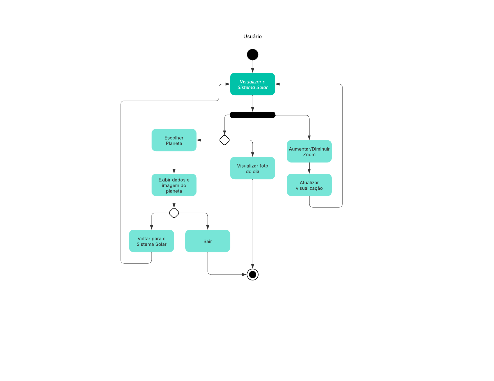
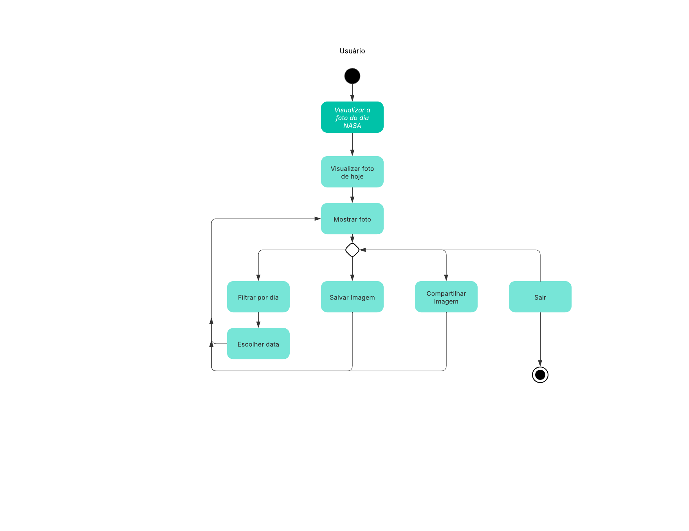

# Diagrama de Atividades

## Introdução

O Diagrama de Atividade é um tipo de diagrama comportamental que representa graficamente o fluxo de controle de uma atividade para outra, se assemelha a um fluxograma, permite modelar comportamento baseado em fluxo [1](#ref1). 

Diagramas de atividade oferecem uma série de benefícios para os usuários. Considere criar um diagrama de atividade para [2](#ref2):

- Demonstrar a lógica de um algoritmo.

- Descrever as etapas realizadas em um caso de uso UML.

- Ilustrar um processo de negócio ou fluxo de trabalho entre usuários e o sistema.

- Simplificar e melhorar qualquer processo ao esclarecer casos de uso complicados.

- Modelar elementos de arquitetura de software, como método, função e operação. 

## Metodologia

Cinco membros foram responsáveis pela elaboração dos diagramas de atividade, desenvolvidos no [Lucidchart](Modelagem/Extra/2.5.2Ferramentas.md). 

Para criar um diagrama de atividade, é necessário um conjunto de símbolos especiais, incluindo aqueles para dar partida, encerrar, fundir ou receber etapas no fluxo, a tabela abaixo apresenta os elementos da UML utilizados nos diagramas de atividade, seu símbolo, seu nome e a descrição [2](#ref2). 

| Símbolo                            | Nome                   | Descrição                                                                                                                                                                    |
|------------------------------------|------------------------|------------------------------------------------------------------------------------------------------------------------------------------------------------------------------|
|   | Nodo Inicial           | Representa o ponto de início do fluxo de atividades. É simbolizado por um círculo preenchido em preto.                                                                       |
|         | Nodo Final             | Indica o término do fluxo de atividades. É representado por um círculo preenchido em preto dentro de outro círculo.                                                          |
|  | Atividade              | Representa uma ação ou tarefa específica no fluxo. É simbolizada por um retângulo com bordas arredondadas contendo a descrição da ação.                                      |
|    | Conector      | Mostra o fluxo de direção, ou fluxo de controle, da atividade. |
|      | Nodo de Decisão        | Indica um ponto de decisão no fluxo onde diferentes caminhos podem ser tomados. É representado por um losango.                                                               |
|           | Barra de Sincronização | Representa um ponto onde o fluxo pode se dividir em atividades paralelas (fork) ou se juntar novamente (join). É simbolizada por uma barra preta horizontal.                 |
|    | Texto de Condição      | Representa a regra ou condição que determina qual caminho o fluxo deve seguir quando encontra um ponto de decisão. É escrito ao lado da linha que sai do losango de decisão. |

## Diagramas de Atividades do Planetário Virtual

### Cadastro e Login de Usuário

**Figura 1:** Diagrama de Atividade de Cadastro e Login de Usuário 

**Autores:** [Antônio Júnior](https://github.com/antonioleaojr), [Carlos Eduardo](https://github.com/dudupaz), [Letícia Torres](https://github.com/leticiatmartins), [João Lucas](https://github.com/jlucasiqueira) e [Taynara Vitorino](https://github.com/taybalau), 2025.

### Uso do Fórum

**Figura 2:** Diagrama de Atividade de Uso do Fórum

**Autores:** [Antônio Júnior](https://github.com/antonioleaojr), [Carlos Eduardo](https://github.com/dudupaz), [Letícia Torres](https://github.com/leticiatmartins), [João Lucas](https://github.com/jlucasiqueira) e [Taynara Vitorino](https://github.com/taybalau), 2025.

### Uso Geral do Site

**Figura 3:** Diagrama de Atividade de Uso Geral do Site

**Autores:** [Antônio Júnior](https://github.com/antonioleaojr), [Carlos Eduardo](https://github.com/dudupaz), [Letícia Torres](https://github.com/leticiatmartins), [João Lucas](https://github.com/jlucasiqueira) e [Taynara Vitorino](https://github.com/taybalau), 2025.

### Visualização do Sistema Solar

**Figura 4:** Diagrama de Atividade da visualização do Sistema Solar do Site

**Autores:** [Antônio Júnior](https://github.com/antonioleaojr), [Carlos Eduardo](https://github.com/dudupaz), [Letícia Torres](https://github.com/leticiatmartins), [João Lucas](https://github.com/jlucasiqueira) e [Taynara Vitorino](https://github.com/taybalau), 2025.

### Visualização da Foto do dia da NASA

**Figura 5:** Diagrama de Atividade da visualização da Foto do Dia 

**Autores:** [Antônio Júnior](https://github.com/antonioleaojr), [Carlos Eduardo](https://github.com/dudupaz), [Letícia Torres](https://github.com/leticiatmartins), [João Lucas](https://github.com/jlucasiqueira) e [Taynara Vitorino](https://github.com/taybalau), 2025.

## Referências Bibliográficas

>1.  Bóson Treinamentos. **O que é um Diagrama de Atividade UML - Introdução**. YouTube, 2022. Disponível em: <https://www.youtube.com/watch?v=_1vHj_j3zDY>. Acesso em: 7 maio 2025. 
>
>2.  Lucidchart. **O que é diagrama de atividades UML?**. Disponível em: <https://www.lucidchart.com/pages/pt/o-que-e-diagrama-de-atividades-uml>. Acesso em: 7 maio 2025.  
>

## Histórico de Versões

| Versão | Data       | Descrição                                      | Autor               | Revisor            |
|--------|------------|------------------------------------------------|---------------------|--------------------|
| 1.0 | 07/05/2025 | Criação do documento com divisões a serem preenchidas conforme o padrão.| [Antônio Júnior](https://github.com/antonioleaojr)  | [Taynara Vitorino](https://github.com/taybalau) |
| 1.1 | 07/05/2025 | Adição da introdução e metodologia, com suas respectivas referências.| [Antônio Júnior](https://github.com/antonioleaojr)  | [Taynara Vitorino](https://github.com/taybalau) |
| 1.2 | 08/05/2025 | Adição dos Diagramas de Atividade de uso geral do site, uso do forum e cadastro de usuário.| [Taynara Vitorino](https://github.com/taybalau)  | [Antônio Júnior](https://github.com/antonioleaojr)  |
| 1.3 | 08/05/2025 | Adição dos Diagramas de Atividade de Visualização do Sistema solar e da Foto do Dia.| [Antônio Júnior](https://github.com/antonioleaojr)  | [Taynara Vitorino](https://github.com/taybalau) |
