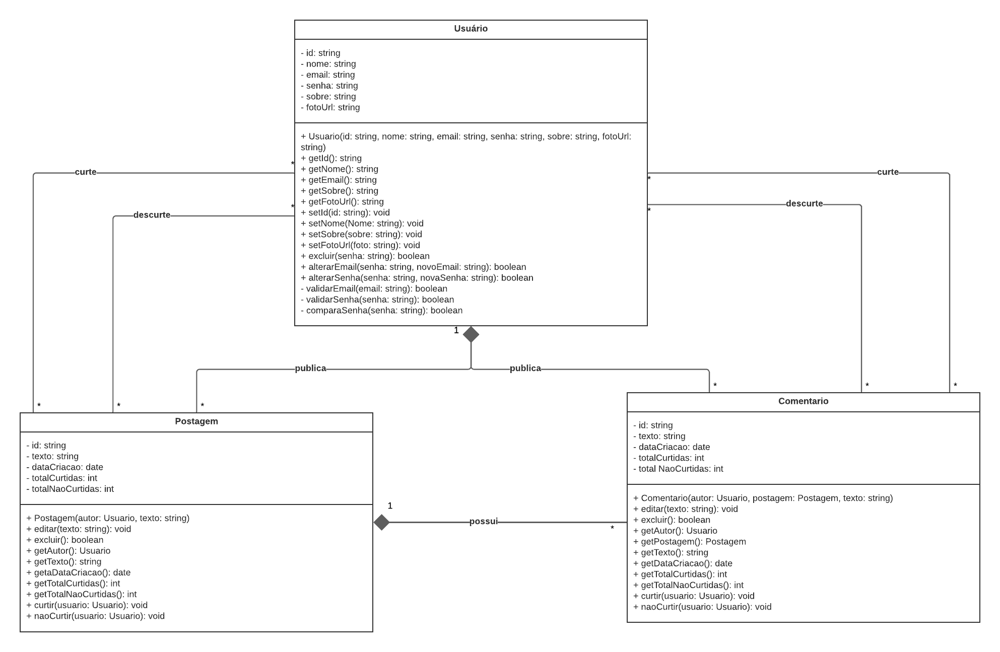

# Diagrama de Classes

## Introdução

O Diagrama de Classes é um dos principais artefatos da UML (Unified Modeling Language), uma linguagem de modelagem gráfica amplamente utilizada para representar sistemas de software <sup>[1](#ref1)</sup>. Especificamente, ele faz parte dos diagramas estruturais da UML, que descrevem os elementos estáticos de um sistema orientado a objetos, como classes, atributos, métodos e os relacionamentos entre eles <sup>[2](#ref2)</sup>.

Este diagrama descreve a estrutura estática do sistema, representando os tipos de objetos que podem existir e como eles se relacionam. As classes são representações de entidades do mundo real e atuam como tipos personalizados que encapsulam dados (atributos) e comportamentos (métodos)<sup>[3](#ref3)</sup>. Visualmente, cada classe é representada como um retângulo dividido em três partes: nome da classe, atributos e métodos. As relações entre classes — como associação, herança, composição e dependência — são indicadas por linhas e setas com notações específicas <sup>[4](#ref4)</sup>.

Além disso, os diagramas de classes servem como base para a implementação de sistemas em linguagens orientadas a objetos, e seu uso é essencial tanto na fase de análise quanto na de projeto. Em projetos grandes, as classes são organizadas em pacotes, facilitando a compreensão e manutenção do sistema <sup>[5](#ref5)</sup>. Como ferramenta de modelagem, o Diagrama de Classes contribui diretamente para a comunicação entre os membros da equipe, para a documentação do projeto e para a construção de uma arquitetura de software sólida <sup>[6](#ref6)</sup>.

## Metodologia

Na UML, o **Diagrama de Classes** utiliza uma notação padronizada para representar visualmente os elementos de um sistema orientado a objetos. A seguir, detalhamos os principais símbolos e representações utilizados neste tipo de diagrama.

### Representação de Atributos

Os atributos descrevem as **características** de uma classe, ou seja, os dados que seus objetos manterão. São representados com a seguinte notação:

```
visibilidade nome: tipo
```

#### Símbolos de visibilidade:

- `+` **(público)**: o atributo é acessível por qualquer classe.
- `-` **(privado)**: o atributo só é acessível dentro da própria classe.
- `#` **(protegido)**: o atributo é acessível na própria classe e nas suas subclasses.
- `~` **(pacote)**: o atributo é acessível somente dentro do mesmo pacote.

**Exemplo**:
```text
- nome: String
+ idade: int
```

Isso indica que o atributo `nome` é privado e do tipo `String`, e que o atributo `idade` é público e do tipo `int`.

---

### Representação de Métodos (Operações)

Os métodos (ou operações) definem os **comportamentos** de uma classe — ou seja, o que os objetos daquela classe podem fazer. A notação é semelhante à dos atributos:

```
visibilidade nome(parâmetros): tipo_de_retorno
```

**Exemplo**:
```text
+ calcularSalario(horas: int): float
```

Isso indica que o método é público, recebe um parâmetro `horas` do tipo `int` e retorna um `float`.

---

### Tipos de Relacionamentos e Setas

No diagrama, as **relações entre classes** são representadas por **linhas e setas** com significados específicos. Abaixo, explicamos cada tipo:

#### 1. Associação

- Representada por uma **linha simples** entre duas classes.
- Indica que uma classe **usa ou conhece** a outra.
- Pode incluir **multiplicidade** (ex: 1..*, 0..1) indicando quantos objetos estão envolvidos.

```
Pessoa -------- Endereço
```

#### 2. Agregação

- Representada por uma **linha com losango branco** na extremidade.
- Indica uma **relação todo-parte**, onde a parte pode existir **independentemente** do todo.

```
Turma ◇-------- Aluno
```

Turma *agrega* vários alunos, mas os alunos podem existir sem a turma.

#### 3. Composição

- Representada por uma **linha com losango preto**.
- Também é uma relação todo-parte, mas com **forte dependência** — a parte **não pode existir** sem o todo.

```
Casa ◆-------- Cômodo
```

Se a `Casa` for destruída, os `Cômodos` também deixam de existir.

#### 4. Generalização (Herança)

- Representada por uma **linha com seta aberta (triângulo) apontando para a superclasse**.
- Indica que uma classe herda atributos e métodos de outra.

```
Funcionario ◁─── Gerente
```

`Gerente` herda de `Funcionario`.

#### 5. Dependência

- Representada por uma **linha tracejada com seta**.
- Indica que uma classe depende temporariamente da outra (ex: usa como parâmetro de método).

```
Pedido - - - - -> Cliente
```

---

### Organização Visual

- Cada classe é representada por um **retângulo com três compartimentos**:
  1. **Nome da classe** (em negrito ou sublinhado, dependendo do tipo).
  2. **Atributos** listados com visibilidade, nome e tipo.
  3. **Métodos** listados com assinatura completa.

---

Essa padronização na representação é fundamental para garantir a clareza e a compreensão entre analistas, desenvolvedores e outros stakeholders ao longo do projeto de software <sup>[1](#ref1)</sup>.


## Diagrama de Classe do Planetário Virtual

<font size="3"><p style="text-align: center"><b>Figura 1:</b> Diagrama de Classe</p></font>
<center>



</center>

<font size="3"><p style="text-align: center"><b>Autores</b>: [João Pedro](https://github.com/JoaoPedrooSS),[Rafael Pereira](https://github.com/rafgpereira),[Milena Rocha](https://github.com/milenafrocha),[Manoel Moura](https://github.com/manoelmoura)e [Raphaela Guimarães](https://github.com/raphaiela) 2025.</p></font>

### Especificação estendida do Diagrama de Classe 

### 1. **Classe `Usuário`**

| **Elemento**        | **Descrição**                                                                                                                                                                                                                                                                                                                |
| ------------------- | ---------------------------------------------------------------------------------------------------------------------------------------------------------------------------------------------------------------------------------------------------------------------------------------------------------------------------- |
| **Atributos**       | - `id: string` — Identificador único do usuário. <br> - `nome: string` — Nome do usuário. <br> - `email: string` — Endereço de email. <br> - `senha: string` — Credencial de acesso. <br> - `sobre: string` — Descrição do usuário. <br> - `fotoUrl: string` — Caminho para a imagem de perfil.                              |
| **Métodos**         | - `excluir()`: Exclui o usuário. <br> - `alterarEmail()`: Altera o email do usuário. <br> - `alterarSenha()`: Altera a senha do usuário. <br> - `validarEmail()`: Valida o formato do email. <br> - `validarSenha()`: Valida a senha. <br> - `comparaSenha(senha: string): boolean`: Verifica se a senha fornecida é válida. |
| **Relacionamentos** | - **Usuário - Postagem**: Composição, onde um usuário pode ter várias postagens. <br> - **Usuário - Comentário**: Composição, onde um usuário pode comentar em postagens.                                                                                                                                                    |

---

### 2. **Classe `Postagem`**

| **Elemento**        | **Descrição**                                                                                                                                                                                                                                                                                                           |
| ------------------- | ----------------------------------------------------------------------------------------------------------------------------------------------------------------------------------------------------------------------------------------------------------------------------------------------------------------------- |
| **Atributos**       | - `id: string` — Identificador único da postagem. <br> - `texto: string` — Conteúdo textual da postagem. <br> - `dataCriacao: date` — Data em que a postagem foi criada. <br> - `totalCurtidas: int` — Contagem de curtidas recebidas. <br> - `totalNaoCurtidas: int` — Contagem de não curtidas recebidas.             |
| **Métodos**         | - `editar()`: Edita o conteúdo da postagem. <br> - `excluir()`: Exclui a postagem. <br> - `curtir(usuario: Usuario)`: Método que permite a um usuário curtir a postagem. <br> - `naoCurtir(usuario: Usuario)`: Método que permite a um usuário não curtir a postagem. <br> |
| **Relacionamentos** | - **Usuário - Postagem**: Composição, onde cada postagem pertence a um único usuário. <br> - **Postagem - Comentário**: Associações de um para muitos (uma postagem pode ter vários comentários). <br> - **Usuário - Reações (curte/nao curte)**: Relacionamento muitos-para-muitos com `Usuário`.                      |

---

### 3. **Classe `Comentario`**

| **Elemento**        | **Descrição**                                                                                                                                                                                                                                                                                                                                                                                         |
| ------------------- | ----------------------------------------------------------------------------------------------------------------------------------------------------------------------------------------------------------------------------------------------------------------------------------------------------------------------------------------------------------------------------------------------------- |
| **Atributos**       | - `id: string` — Identificador único do comentário. <br> - `texto: string` — Conteúdo do comentário. <br> - `dataCriacao: date` — Data em que o comentário foi criado. <br> - `totalCurtidas: int` — Contagem de curtidas no comentário. <br> - `totalNaoCurtidas: int` — Contagem de não curtidas no comentário.                                                                                     |
| **Métodos**         | - `editar()`: Edita o conteúdo do comentário. <br> - `excluir()`: Exclui o comentário. <br> - `curtir(usuario: Usuario)`: Método que permite a um usuário curtir o comentário. <br> - `naoCurtir(usuario: Usuario)`: Método que permite a um usuário não curtir o comentário. <br>  |
| **Relacionamentos** | - **Usuário - Comentário**: Composição, onde um comentário é sempre feito por um usuário. <br> - **Postagem - Comentário**: Associação simples, onde cada comentário está associado a uma única postagem. <br> - **Usuário - Reações (curte/nao curte)**: Relacionamento muitos-para-muitos com `Usuário`.                                                                                            |

---

### 4. **Relacionamentos** (Resumo)

| **Entidade** | **Entidade** | **Relacionamento** | **Cardinalidade** |**Descrição**                                                                                      |
| -------------- | -------------- | -------------------------- | ----------------- | -------------------------------------------------------------------------------------------------- |
| **Usuário**    | **Postagem**   | Composição                 | 1\:N              | Um usuário pode criar muitas postagens, mas cada postagem pertence a um único usuário.             |
| **Usuário**    | **Comentário** | Composição                 | 1\:N              | Um usuário pode criar muitos comentários, mas cada comentário pertence a um único usuário.         |
| **Postagem**   | **Comentário** | Associação simples         | 1\:N              | Uma postagem pode ter muitos comentários, mas cada comentário refere-se a uma única postagem.      |
| **Usuário**    | **Postagem**   | Reações (curte/descurte)   | M\:N              | Um usuário pode curtir ou descurtir várias postagens, e cada postagem pode ter várias reações.     |
| **Usuário**    | **Comentário** | Reações (curte/descurte)   | M\:N              | Um usuário pode curtir ou descurtir vários comentários, e cada comentário pode ter várias reações. |

---


## Referências Bibliográficas

>1. <a id="ref1"></a> FOWLER, Martin. *UML Essencial*. 3. ed. Rio de Janeiro: Alta Books, 2010.  
>
>2. <a id="ref2"></a> Bóson Treinamentos. **Curso de UML - O que é um Diagrama de Classes**. YouTube, 2020. Disponível em: <https://www.youtube.com/watch?v=5jR3ZT9bz5M>. Acesso em: 1 maio 2025.  
>
>3. <a id="ref3"></a> GUEDES, Gilleanes. **Diagrama de Pacotes - UML**. YouTube, 2020. Disponível em: <https://www.youtube.com/watch?v=HZJ2DLFOwyo>. Acesso em: 1 maio 2025.  
>
>4. <a id="ref4"></a> OLIVEIRA, George. **Diagrama de Sequência**. YouTube, 2021. Disponível em: <https://www.youtube.com/watch?v=zgWY8LRJ-90>. Acesso em: 1 maio 2025.  
>
>5. <a id="ref5"></a> GUEDES, Gilleanes. **Engenharia de Software e UML**. Canal YouTube, várias datas.  
>
>6. <a id="ref6"></a> FOWLER, Martin. *UML Essencial*. Trechos adaptados do PDF: *UML-Essencial-Martin-Fowler.pdf*. 


## Histórico de Versões

| Versão | Data       | Descrição                                      | Autor               | Revisor            |
|--------|------------|------------------------------------------------|---------------------|--------------------|
| 1.0    | 30/04/2025 | Criação do documento com divisões a serem preenchidas conforme o padrão | [Milena Rocha](https://github.com/milenafrocha)          | [Rafael Pereira](https://github.com/rafgpereira)  |
| 1.1    | 01/05/2025 | Adição de introdução e metodologia bem como suas respectivas referências | [Milena Rocha](https://github.com/milenafrocha)          | [Rafael Pereira](https://github.com/rafgpereira)  |
| 1.2    | 01/05/2025 | Adição da foto do diagrama | [Milena Rocha](https://github.com/milenafrocha)          | [Rafael Pereira](https://github.com/rafgpereira)  |
| 1.3    | 05/05/2025 | Ajustes de hiperlinks e da foto do diagrama | [Milena Rocha](https://github.com/milenafrocha)          | [Rafael Pereira](https://github.com/rafgpereira)  |
| 1.4    | 05/05/2025 | Refatoração conjunta |[João Pedro](https://github.com/JoaoPedrooSS),[Rafael Pereira](https://github.com/rafgpereira),[Milena Rocha](https://github.com/milenafrocha),[Manoel Moura](https://github.com/manoelmoura)e [Raphaela Guimarães](https://github.com/raphaiela) | [Rafael Pereira](https://github.com/rafgpereira)  |


