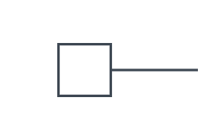
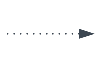
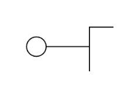
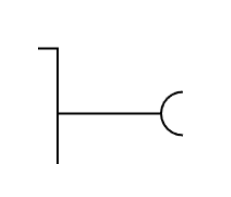
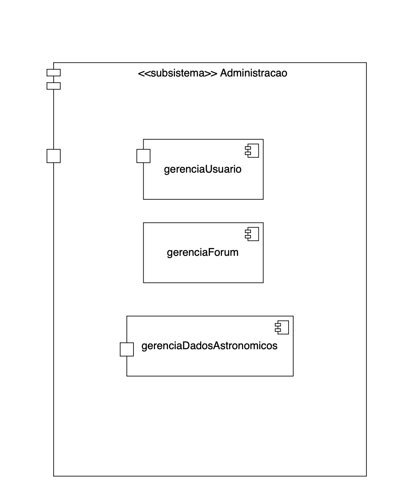
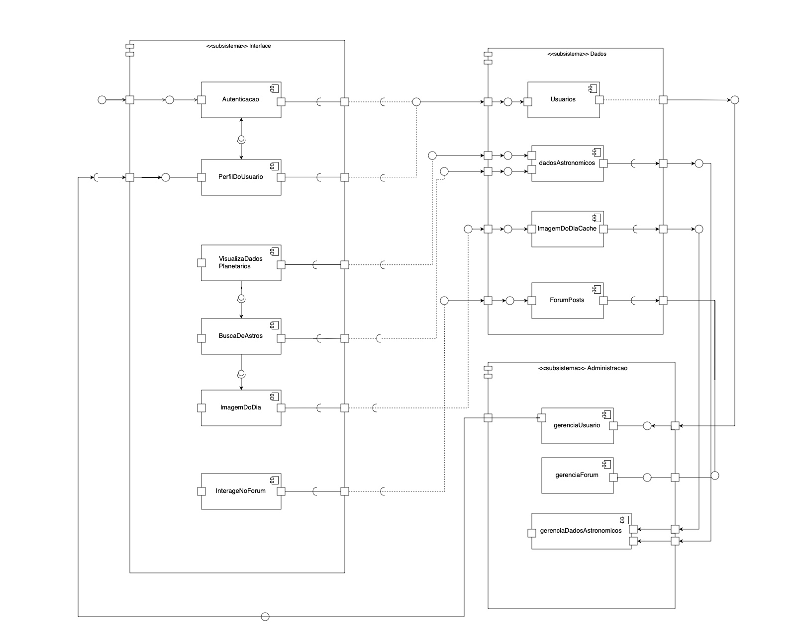

#  Diagrama de Componentes

## Introdução

O diagrama de componentes da UML (Unified Modeling Language) é um modelo estrutural utilizado para representar a organização e a dependência entre os componentes físicos de um sistema de software1. Um componente, nesse contexto, é definido como uma unidade modular com uma interface bem definida que encapsula sua implementação interna e pode ser facilmente substituída ou reutilizada. Esse tipo de diagrama é particularmente útil na modelagem de sistemas de médio a grande porte, pois permite visualizar a arquitetura de alto nível, evidenciando como os diferentes módulos — como bibliotecas, arquivos executáveis, APIs ou serviços — se comunicam entre si por meio de interfaces e dependências1. De acordo com a especificação oficial da UML, os diagramas de componentes são essenciais na fase de projeto e implantação, por fornecerem uma visão clara da estrutura física do sistema e das relações entre os artefatos de software2.

## Metodologia

A construção deste conteúdo baseou-se em uma abordagem qualitativa e bibliográfica, com o objetivo de apresentar, de forma clara e concisa, os principais conceitos relacionados ao diagrama de componentes da UML. Foram consultadas fontes especializadas e reconhecidas na área de engenharia de software, como o livro UML Distilled de Martin Fowler1 e a especificação oficial da UML publicada pela Object Management Group (OMG)2. A seguir, detalhamos os principais símbolos e representações utilizados neste tipo de diagrama. 

## Representação do símbolo de componente 
O componente é uma entidade necessária para executar uma função de estereótipo. O componente fornece e consome comportamento em interfaces ou por meio de outros componentes.

<b>Figura 1:</b> símbolo de Componente

<b>Autores</b>: [João Lucas](https://github.com/jlucasiqueira), [Leticia Martins](https://github.com/leticiatmartins), [Carlos Eduardo](https://github.com/dudupaz), [Taynara Vitorino](https://github.com/taybalau) e [Antônio Júnior](https://github.com/antonioleaojr), 2025.

## Representação do símbolo de Porta
A porta especifica um ponto de interação separado entre o componente e o ambiente. 

<b>Figura 2:</b> símbolo de Porta

<b>Autores</b>: [João Lucas](https://github.com/jlucasiqueira), [Leticia Martins](https://github.com/leticiatmartins), [Carlos Eduardo](https://github.com/dudupaz), [Taynara Vitorino](https://github.com/taybalau) e [Antônio Júnior](https://github.com/antonioleaojr), 2025.

## Representação do símbolo de Dependência
Mostra que uma parte do sistema depende de outra. A dependência é representada por linhas tracejadas que vinculam um componente (ou elemento) a outro. 

<b>Figura 3:</b> símbolo de dependência

<b>Autores</b>: [João Lucas](https://github.com/jlucasiqueira), [Leticia Martins](https://github.com/leticiatmartins), [Carlos Eduardo](https://github.com/dudupaz), [Taynara Vitorino](https://github.com/taybalau) e [Antônio Júnior](https://github.com/antonioleaojr), 2025.

## Representação dos símbolos de Interface
Em diagramas de componentes, interfaces são pontos de comunicação entre os componentes — ou seja, onde um componente "conversa" com outro. Assim como nas classes, os componentes também podem declarar interfaces fornecidas e interfaces necessárias. Essas interfaces são representadas com símbolos visuais específicos no diagrama.

### Interface Fornecida
Representada por um círculo conectado a uma linha que sai da caixa do componente.Significa que esse
 componente oferece um serviço ou funcionalidade.

 
<b>Figura 4:</b> símbolo de Interface Fornecida

<b>Autores</b>: [João Lucas](https://github.com/jlucasiqueira), [Leticia Martins](https://github.com/leticiatmartins), [Carlos Eduardo](https://github.com/dudupaz), [Taynara Vitorino](https://github.com/taybalau) e [Antônio Júnior](https://github.com/antonioleaojr), 2025.

### Interface Necessária
Representada por um semicírculo (meia-lua) conectado a uma linha que sai da caixa do componente, significa que esse componente precisa de um serviço ou funcionalidade que outro componente oferece.
 
<b>Figura 5:</b> símbolo de Interface Necessária

<b>Autores</b>: [João Lucas](https://github.com/jlucasiqueira), [Leticia Martins](https://github.com/leticiatmartins), [Carlos Eduardo](https://github.com/dudupaz), [Taynara Vitorino](https://github.com/taybalau) e [Antônio Júnior](https://github.com/antonioleaojr), 2025.

## Representação dos símbolo de Subsistema
Para organizar sistemas maiores, componentes podem ser agrupados em subsistemas, representados por um retângulo maior com o estereótipo `<<subsystem>>`. Os componentes internos e as interfaces do subsistema podem ser mostrados dentro desse retângulo.
á

<b>Figura 6:</b> símbolo de Subsistema

<b>Autores</b>: [João Lucas](https://github.com/jlucasiqueira), [Leticia Martins](https://github.com/leticiatmartins), [Carlos Eduardo](https://github.com/dudupaz), [Taynara Vitorino](https://github.com/taybalau) e [Antônio Júnior](https://github.com/antonioleaojr), 2025.

## Diagrama de Componentes do Planetário Virtual
Para a confecção do diagrama de Componentes, foram feitas duas reuniões, uma reunião para a divisão de tarefas entre os membros, disponível [aqui](Modelagem/Extra/Atas/ata4.md), e uma segunda reunião para validação do diagrama de componente junto aos membros que estavam presentes na reunião disponível [aqui](Modelagem/Extra/Atas/ata6.md). A ferramenta utilizada para sua elaboração foi o Draw.io.

A elaboração do diagrama de componentes foi inicialmente designada a dois membros principais da equipe, conforme registrado na primeira reunião supracitada. Os demais integrantes participariam subsequentemente na validação do diagrama, colaborando em seu refinamento e nos ajustes finais.

Um dos desafios primordiais consistiu na definição do escopo dos componentes a serem representados no diagrama. Com base na [Baseline de Requisitos](https://unbarqdsw2025-1-turma02.github.io/2025.1-T02-_G7_PlanetarioVirtual_Entrega_01/#/./Base/Elicitacao/1.6.3RequisitosElicitados), optou-se por estruturar o diagrama em três subsistemas principais.

Em sequência, procedeu-se à identificação dos componentes integrantes de cada subsistema e ao estabelecimento de suas interconexões. Durante este processo, emergiu uma divergência de entendimento entre os dois responsáveis principais pela elaboração do diagrama no que concerne à designação dos componentes fornecedores e requisitantes de interfaces. Contudo, após uma discussão dedicada à apresentação e análise dos respectivos pontos de vista, a referida discordância foi resolvida de forma colaborativa.

Finalmente, na última reunião, os membros responsáveis pela elaboração apresentaram uma explanação detalhada da estrutura e do funcionamento do diagrama ao restante da equipe. Os participantes tiveram a oportunidade de expressar suas opiniões e sugerir modificações, além de contribuir para os detalhes finais de estilização e organização visual do artefato.

O **Diagrama de Componentes** elaborado após todas as decisões tomadas pode ser visualizado na **Figura 7** abaixo, e sua descrição está detalhada na **Especificação estendida**.

---

<b>Figura 7:</b> Diagrama de Componentes

<b>Autores</b>: [João Lucas](https://github.com/jlucasiqueira), [Leticia Martins](https://github.com/leticiatmartins), [Carlos Eduardo](https://github.com/dudupaz), [Taynara Vitorino](https://github.com/taybalau) e [Antônio Júnior](https://github.com/antonioleaojr), 2025.

### Especificação estendida do Diagrama de Componentes

O diagrama de componentes do Planetário Virtual é estruturado em três subsistemas principais: `Interface`, `Dados` e `Administração`. A seguir, detalhamos os componentes presentes em cada subsistema e seus relacionamentos.

### Subsistema Interface
Este subsistema é responsável pela interação com o usuário e engloba os seguintes componentes:

### Autenticação: 
Responsável por gerenciar o processo de login e logout de usuários.

`Interface Requerida:` (Usuarios) - Requer serviços de gerenciamento de usuários do subsistema Dados.
### PerfilDoUsuario
 Permite aos usuários visualizar e gerenciar seus perfis.

I`Interface Requerida:` (Usuarios) - Requer dados do usuário do subsistema Dados e serviços de autenticação.
### VisualizaDadosPlanetarios
 Permite aos usuários visualizar informações sobre corpos celestes.

`Interfaces Requeridas:` (dadosAstronomicos)  - Requer dados astronômicos do subsistema Dados.
### BuscaDeAstros
 Facilita a busca por informações específicas sobre astros.

`Interface Requerida:` (dadosAstronomicos) e (VisualizaDadosPlanetarios)- Requer dados astronômicos do subsistema Dados.
### ImagemDoDia
 Exibe a imagem astronômica do dia.

`Interface Requerida:` (dadosAstronomicos) e (BuscaDeAstros) - Requer dados da imagem do dia do subsistema Dados.
### InterageNoForum: 
Permite aos usuários interagir no fórum, criando e visualizando posts.

`Interface Requerida:` (ForumPosts) - Requer dados do fórum do subsistema Dados e serviços de autenticação.
### Subsistema Dados
Este subsistema é responsável pelo armazenamento e gerenciamento dos dados do sistema:

### Usuarios: 
Gerencia as informações dos usuários.

`Interface Fornecida:` (Usuarios) - Fornece dados e serviços de gerenciamento de usuários.

### dadosAstronomicos: 
Armazena e fornece dados sobre corpos celestes.

`Interface Fornecida:` (dadosAstronomicos) - Fornece dados astronômicos.
`Interface Requerida:` (gerenciaDadosAstronomicos) - Requer os dados gerenciados no componente gerenciaDadosAstronomicos.

### ImagemDoDiaCache: 
Mantém em cache a imagem astronômica do dia para acesso rápido.

`Interface Fornecida:` (ImagemDoDiaCache) - Fornece a imagem do dia.
`Interface Requerida:` (gerenciaDadosAstronomicos) - Requer a imagem presente no componente gerenciaDadosAstronomicos.

### ForumPosts: 
Armazena e gerencia os posts do fórum.

`Interface Fornecida:` (ForumPosts) - Fornece dados e serviços de gerenciamento do fórum.
`Interface Requerida:` (gerenciaForum) - Requer o resultado da gerência do fórum feita no gerenciaForum

### Subsistema Administração
Este subsistema oferece funcionalidades para a administração do sistema:

### gerenciarUsuario: 
Permite aos administradores gerenciar as contas dos usuários.

`Interface Requerida:` (PerfilDoUsuario) e (Usuarios) - Requer dados de usuários do subsistema Dados.

### gerenciarForum: 
Permite aos administradores moderar o fórum.

`Interface Requerida:` (ForumPosts) - Requer dados do fórum do subsistema Dados.

### gerenciarDadosAstronomicos: 
Permite aos administradores gerenciar os dados astronômicos do sistema.

`Interface Requerida:` (dadosAstronomicos) - Requer acesso e manipulação dos dadosAstronomicos do subsistema Dados.

## Referências Bibliográficas

>1.  FOWLER, Martin. UML Distilled: A Brief Guide to the Standard Object Modeling Language. 3. ed. Boston: Addison-Wesley, 2003.
>2. OMG – Object Management Group. UML 2.5 Specification. 2015. Disponível em: https://www.omg.org/spec/UML/2.5/. Acesso em: 08 maio 2025.

| Versão | Data       | Descrição                                      | Autor               | Revisor            |
|--------|------------|------------------------------------------------|---------------------|--------------------|
| 1.0    | 08/05/2025 | Criação do documento e adição de Introdução, Metodologia e Referências  | [Leticia Martins ](https://github.com/leticiatmartins)          | [Rafael Pereira](https://github.com/rafgpereira)  |
| 1.1    | 08/05/2025 | Adição de Representações, Especificação Estendida e do Diagrama de Componentes | [João Lucas](https://github.com/jlucasiqueira)          | [Rafael Pereira](https://github.com/rafgpereira)  |
