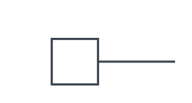
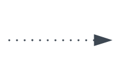
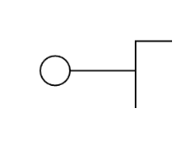
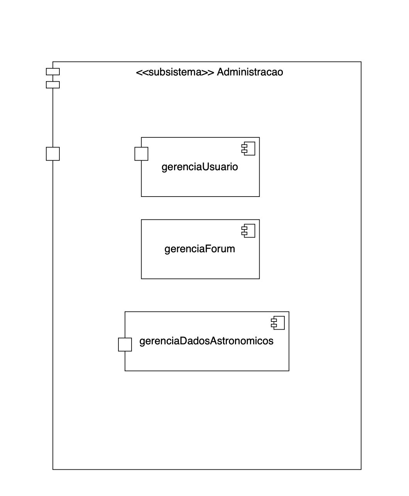

#  Diagrama de Componentes

## Introdução

O diagrama de componentes da UML (Unified Modeling Language) é um modelo estrutural utilizado para representar a organização e a dependência entre os componentes físicos de um sistema de software1. Um componente, nesse contexto, é definido como uma unidade modular com uma interface bem definida que encapsula sua implementação interna e pode ser facilmente substituída ou reutilizada. Esse tipo de diagrama é particularmente útil na modelagem de sistemas de médio a grande porte, pois permite visualizar a arquitetura de alto nível, evidenciando como os diferentes módulos — como bibliotecas, arquivos executáveis, APIs ou serviços — se comunicam entre si por meio de interfaces e dependências1. De acordo com a especificação oficial da UML, os diagramas de componentes são essenciais na fase de projeto e implantação, por fornecerem uma visão clara da estrutura física do sistema e das relações entre os artefatos de software2.

## Metodologia

A construção deste conteúdo baseou-se em uma abordagem qualitativa e bibliográfica, com o objetivo de apresentar, de forma clara e concisa, os principais conceitos relacionados ao diagrama de componentes da UML. Foram consultadas fontes especializadas e reconhecidas na área de engenharia de software, como o livro UML Distilled de Martin Fowler1 e a especificação oficial da UML publicada pela Object Management Group (OMG)2. A seguir, detalhamos os principais símbolos e representações utilizados neste tipo de diagrama. 

## Representação do símbolo de componente 
O componente é uma entidade necessária para executar uma função de estereótipo. O componente fornece e consome comportamento em interfaces ou por meio de outros componentes.

<b>Figura 1:</b> símbolo de Componente

<b>Autores</b>: [João Lucas](https://github.com/jlucasiqueira), [Leticia Martins](https://github.com/leticiatmartins), [Carlos Eduardo](https://github.com/dudupaz), [Taynara Vitorino](https://github.com/taybalau) e [Antônio Júnior](https://github.com/antonioleaojr), 2025.

## Representação do símbolo de Porta
A porta especifica um ponto de interação separado entre o componente e o ambiente. 

<b>Figura 2:</b> símbolo de Porta

<b>Autores</b>: [João Lucas](https://github.com/jlucasiqueira), [Leticia Martins](https://github.com/leticiatmartins), [Carlos Eduardo](https://github.com/dudupaz), [Taynara Vitorino](https://github.com/taybalau) e [Antônio Júnior](https://github.com/antonioleaojr), 2025.

## Representação do símbolo de Dependência
Mostra que uma parte do sistema depende de outra. A dependência é representada por linhas tracejadas que vinculam um componente (ou elemento) a outro. 

<b>Figura 3:</b> símbolo de dependência

<b>Autores</b>: [João Lucas](https://github.com/jlucasiqueira), [Leticia Martins](https://github.com/leticiatmartins), [Carlos Eduardo](https://github.com/dudupaz), [Taynara Vitorino](https://github.com/taybalau) e [Antônio Júnior](https://github.com/antonioleaojr), 2025.

## Representação dos símbolos de Interface
Em diagramas de componentes, interfaces são pontos de comunicação entre os componentes — ou seja, onde um componente "conversa" com outro. Assim como nas classes, os componentes também podem declarar interfaces fornecidas e interfaces necessárias. Essas interfaces são representadas com símbolos visuais específicos no diagrama.

### Interface Fornecida
Representada por um círculo conectado a uma linha que sai da caixa do componente.Significa que esse
 componente oferece um serviço ou funcionalidade.

 
<b>Figura 4:</b> símbolo de Interface Fornecida

<b>Autores</b>: [João Lucas](https://github.com/jlucasiqueira), [Leticia Martins](https://github.com/leticiatmartins), [Carlos Eduardo](https://github.com/dudupaz), [Taynara Vitorino](https://github.com/taybalau) e [Antônio Júnior](https://github.com/antonioleaojr), 2025.

### Interface Necessária
Representada por um semicírculo (meia-lua) conectado a uma linha que sai da caixa do componente, significa que esse componente precisa de um serviço ou funcionalidade que outro componente oferece.
 
<b>Figura 5:</b> símbolo de Interface Necessária

<b>Autores</b>: [João Lucas](https://github.com/jlucasiqueira), [Leticia Martins](https://github.com/leticiatmartins), [Carlos Eduardo](https://github.com/dudupaz), [Taynara Vitorino](https://github.com/taybalau) e [Antônio Júnior](https://github.com/antonioleaojr), 2025.

## Representação dos símbolo de Subsistema
Para organizar sistemas maiores, componentes podem ser agrupados em subsistemas, representados por um retângulo maior com o estereótipo `<<subsystem>>`. Os componentes internos e as interfaces do subsistema podem ser mostrados dentro desse retângulo.
á

<b>Figura 6:</b> símbolo de Subsistema

<b>Autores</b>: [João Lucas](https://github.com/jlucasiqueira), [Leticia Martins](https://github.com/leticiatmartins), [Carlos Eduardo](https://github.com/dudupaz), [Taynara Vitorino](https://github.com/taybalau) e [Antônio Júnior](https://github.com/antonioleaojr), 2025.

## Diagrama de Componentes do Planetário Virtual
Para a confecção do diagrama de Componentes, foram feitas duas reuniões, uma reunião para a divisão de tarefas entre os membros, disponível [aqui](Modelagem/Extra/Atas/ata4.md), e uma segunda e

## Referências Bibliográficas

>1.  FOWLER, Martin. UML Distilled: A Brief Guide to the Standard Object Modeling Language. 3. ed. Boston: Addison-Wesley, 2003.
>2. OMG – Object Management Group. UML 2.5 Specification. 2015. Disponível em: https://www.omg.org/spec/UML/2.5/. Acesso em: 08 maio 2025.