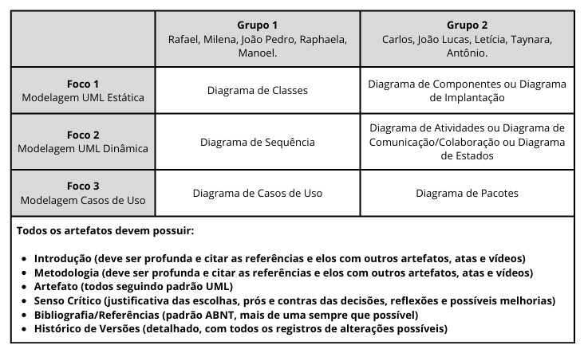

# Ata da Reunião 1 – Arquitetura e Desenho de Software

**Data:** 26/04/2025  
**Participantes Presentes:**
- João Pedro Silva Sousa  
- Manoel Castro Moura Filho  
- Raphaela Guimarães de Araújo dos Santos  
- Rafael Gomes Pereira  
- Milena Fernandes Rocha  

---

## Assunto

Reunião de planejamento da Entrega 2 da disciplina, com foco na definição dos artefatos a serem produzidos e divisão do grupo em duas equipes de trabalho.

---

## Próxima Reunião

**Atividades previstas:**
- Reuniões separadas por grupo para a criação e refinamento dos artefatos definidos.  
- Apresentação dos primeiros esboços para validação conjunta.

---

## Consolidação da Reunião

> Organização realizada durante a reunião de 26/04/2025.

### Divisão de Grupos e Artefatos

**Imagem 1: Divisão dos Grupos**

<b>Autores: [Rafael Pereira](https://github.com/rafgpereira)</b>

---

**Tabela 1: Divisão dos Grupos**

|                       | **Grupo 1** | **Grupo 2** |
|-----------------------|-------------|-------------|
| **Integrantes**       | Rafael, Milena, João Pedro, Raphaela, Manoel. | Carlos, João Lucas, Letícia, Taynara, Antônio. |
| **Foco 1** Modelagem UML Estática | Diagrama de Classes | Diagrama de Componentes ou Diagrama de Implantação |
| **Foco 2** Modelagem UML Dinâmica | Diagrama de Sequência | Diagrama de Atividades ou Diagrama de Comunicação/Colaboração ou Diagrama de Estados |
| **Foco 3** Modelagem Casos de Uso | Diagrama de Casos de Uso | Diagrama de Pacotes |

<b>Autores: [Milena Rocha](https://github.com/MilenaFRocha)</b>

**Todos os artefatos devem possuir:**

- **Introdução** (deve ser profunda e citar as referências e elos com outros artefatos, atas e vídeos)
- **Metodologia** (deve ser profunda e citar as referências e elos com outros artefatos, atas e vídeos)
- **Artefato** (todos seguindo padrão UML)
- **Senso Crítico** (justificativa das escolhas, prós e contras das decisões, reflexões e possíveis melhorias)
- **Bibliografia/Referências** (padrão ABNT, mais de uma sempre que possível)
- **Histórico de Versões** (detalhado, com todos os registros de alterações possíveis)

- Cada grupo ficará responsável pela produção completa de um artefato específico.
- As tarefas foram divididas de maneira que cada grupo possa se organizar de forma independente e focada.

---

## Cronograma da Reunião

Na Tabela 2 estão listadas as informações técnicas da reunião.

**Tabela 2: Cronograma da Reunião**

| Data       | Hora  | Mediador              | Duração | Local                  |
|------------|-------|------------------------|---------|------------------------|
| 26/04/2025 | 15:30 | [Rafael Pereira](https://github.com/rafgpereira) | 41min    | Online (Microsoft Teams) |

<b>Autores: [Milena Rocha](https://github.com/MilenaFRocha)</b>

---

## Encaminhamentos
- Próximas reuniões serão realizadas em separado, dentro dos próprios grupos.  
- Cada grupo deve apresentar uma primeira versão do artefato na próxima reunião geral.  
- Continuidade da entrega 2 conforme planejamento inicial.

---

## Link da Gravação

Reunião realizada via Teams e gravada. 

Vídeo 1: 1ª Reunião - Planning da Entrega 2

<iframe width="560" height="315" src="https://www.youtube.com/embed/Yj7EPjaOqNI?si=FXz1bI_4F4TF_H7w" title="YouTube video player" frameborder="0" allow="accelerometer; autoplay; clipboard-write; encrypted-media; gyroscope; picture-in-picture; web-share" referrerpolicy="strict-origin-when-cross-origin" allowfullscreen></iframe>

<b>Autores: [Milena Rocha](https://github.com/MilenaFRocha)</b> . 1ª Reunião - Planning da Entrega 2. Disponível em: <a href="https://www.youtube.com/watch?v=Yj7EPjaOqNI">https://www.youtube.com/watch?v=Yj7EPjaOqNI</a>. Acesso em: 26 de abril 2025.

---

_Reunião encerrada com a definição clara dos grupos e atividades da Entrega 2._

---

### Histórico de Versão

| Versão | Data       | Descrição                                      | Autor               | Revisor            |
|--------|------------|------------------------------------------------|---------------------|--------------------|
| 1.0    | 26/04/2025 | Criação do documento e tabelas, upload do vídeo e padronização | [Milena Rocha](https://github.com/milenafrocha)          | [Rafael Pereira](https://github.com/rafgpereira)  |
| 1.1    | 26/04/2025 | Ajustes de imagens e autores | [Milena Rocha](https://github.com/milenafrocha)          | [Rafael Pereira](https://github.com/rafgpereira)  |
| 1.2    | 29/04/2025 | Exclusão de imagem depois da revisão | [Milena Rocha](https://github.com/milenafrocha)          | [Rafael Pereira](https://github.com/rafgpereira)  |
