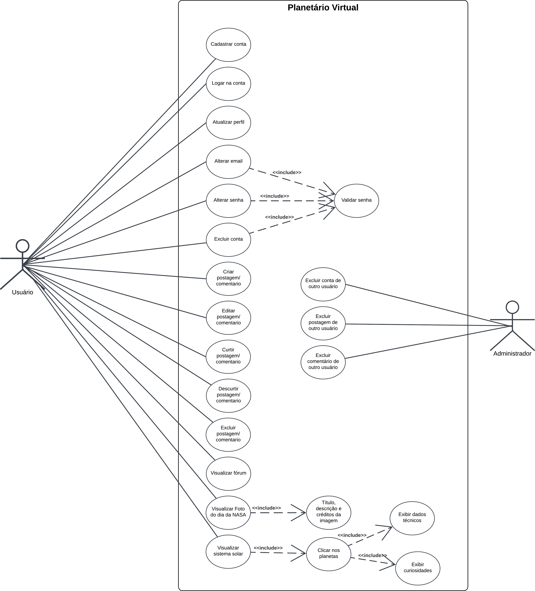

# Diagrama de Casos de Uso

## Introdução

O Diagrama de Casos de Uso é um dos principais diagramas comportamentais da UML (Unified Modeling Language), utilizado para capturar e representar as funcionalidades de um sistema do ponto de vista do usuário [1](#ref1). Ele permite identificar os atores (usuários ou sistemas externos) e os casos de uso (funções ou serviços oferecidos pelo sistema), evidenciando como os atores interagem com o sistema para atingir determinados objetivos [2](#ref2).

Esse tipo de diagrama é particularmente útil nas fases iniciais do desenvolvimento de software, pois auxilia na elicitação e validação de requisitos funcionais de forma clara e acessível tanto para a equipe técnica quanto para os stakeholders não técnicos. Os elementos são representados graficamente por elipses (casos de uso), figuras estilizadas de pessoas (atores) e linhas que indicam interações. Também é possível utilizar relacionamentos como inclusão, extensão e generalização, para representar variações e dependências entre os casos de uso.

Além de servir como guia para o desenvolvimento e para a escrita de cenários de testes, o Diagrama de Casos de Uso também contribui para a comunicação entre os membros da equipe e para a compreensão global do sistema que está sendo construído. Sua simplicidade e foco nas interações tornam-no uma ferramenta eficaz para garantir que as funcionalidades previstas estejam alinhadas às necessidades dos usuários [4](#ref4).

## Metodologia

Na UML, o Diagrama de Casos de Uso segue uma notação padronizada para representar visualmente as funcionalidades do sistema e as interações com os usuários ou sistemas externos. A seguir, detalhamos os principais elementos gráficos e suas representações neste tipo de diagrama.

## Representação dos Atores

Os atores representam usuários, sistemas ou entidades externas que interagem com o sistema modelado. São geralmente representados por figuras estilizadas de pessoas (bonecos palito) [2](#ref2).

<b>Figura 1:</b> Atores

<b>Autores</b>: [João Pedro](https://github.com/JoaoPedrooSS), [Rafael Pereira](https://github.com/rafgpereira), [Milena Rocha](https://github.com/milenafrocha), [Manoel Moura](https://github.com/manoelmoura) e [Raphaela Guimarães](https://github.com/raphaiela), 2025.

## Representação dos Casos de Uso

Os casos de uso são as ações que os atores podem fazer no sistema. São representados por elipses contendo o nome da ação no centro [2](#ref2).

<b>Figura 2:</b> Casos de uso

<b>Autores</b>: [João Pedro](https://github.com/JoaoPedrooSS), [Rafael Pereira](https://github.com/rafgpereira), [Milena Rocha](https://github.com/milenafrocha), [Manoel Moura](https://github.com/manoelmoura) e [Raphaela Guimarães](https://github.com/raphaiela), 2025.

## Conexões (Associações)

A relação entre um ator e um caso de uso é mostrada por uma linha reta simples, indicando que o ator pode executar aquela funcionalidade [2](#ref2).

<b>Figura 3:</b> Associações

<b>Autores</b>: [João Pedro](https://github.com/JoaoPedrooSS), [Rafael Pereira](https://github.com/rafgpereira), [Milena Rocha](https://github.com/milenafrocha), [Manoel Moura](https://github.com/manoelmoura) e [Raphaela Guimarães](https://github.com/raphaiela), 2025.

## Relacionamentos Especiais

### Inclusão (<< include >>)

O relacionamento de inclusão é usado quando uma funcionalidade obrigatória de um caso de uso sempre envolve a execução de outro caso de uso. Ou seja, um caso de uso sempre inclui um comportamento comum, reutilizável, dentro de outro.

**O caso de uso "Alterar senha" sempre inclui a ação "Validar senha".**

<b>Figura 4:</b> Include

<b>Autores</b>: [João Pedro](https://github.com/JoaoPedrooSS), [Rafael Pereira](https://github.com/rafgpereira), [Milena Rocha](https://github.com/milenafrocha), [Manoel Moura](https://github.com/manoelmoura) e [Raphaela Guimarães](https://github.com/raphaiela), 2025.

### Extensão (<< extend >>)

O relacionamento de extensão é usado quando um comportamento opcional pode ser adicionado a um caso de uso, dependendo de alguma condição. Ou seja, o caso de uso base pode ser estendido por outro caso de uso de forma condicional.

**Pgit ara o caso de uso "Visualizar Dados" ser executado, o usuário deve primeiro passar pelo caso de uso "Login".**

<b>Figura 5:</b> Extend

<b>Autores</b>: [João Pedro](https://github.com/JoaoPedrooSS), [Rafael Pereira](https://github.com/rafgpereira), [Milena Rocha](https://github.com/milenafrocha), [Manoel Moura](https://github.com/manoelmoura) e [Raphaela Guimarães](https://github.com/raphaiela), 2025.

## Organização Visual

- Um **diagrama** típico é composto por [2](#ref2):
  1. Um **retângulo de sistema** (opcional) que delimita os **casos de uso internos**.
  2. **Atores** posicionados **fora do sistema**.
  3. **Casos de uso** dispostos **dentro do retângulo**, conectados por **linhas de associação e setas de relacionamento**.

## Diagrama de Casos de Uso

Esse diagrama, por ser mais simples, foi desenvolvido em apenas uma reunião online com os participantes. A ata e a gravação da reunião podem ser acessadas aqui: [Ata - Casos de Uso](Modelagem/Extra/Atas/ata5.md). A ferramenta utilizada para sua elaboração foi o Lucidchart.

Inicialmente, para a modelagem, foi analisado o domínio do sistema por meio do [Diagrama de Classes](Modelage/Estatica/Classes.md), a partir do qual foram extraídas as operações relacionadas às três classes principais: `Usuário`, `Postagem` e `Comentário`incluindo seus respectivos CRUDs e demais operações. No entanto, ao contrário do [Diagrama de Classes](Modelage/Estatica/Classes.md), esse diagrama de casos de uso permite abordar um escopo mais completo da aplicação, incluindo as funcionalidades exibidas no frontend. Para ampliar os casos de uso com base nesse escopo, foi consultada a [Baseline de Requisitos](https://unbarqdsw2025-1-turma02.github.io/2025.1-T02-_G7_PlanetarioVirtual_Entrega_01/#/./Base/Elicitacao/1.6.3RequisitosElicitados) do projeto, permitindo assim a inclusão de casos que extrapolam o modelo de domínio. A partir dessa análise, também foi identificado um novo ator: o **administrador**, cuja presença é fundamental para a moderação de sistemas de interação pública, como o Planetário Virtual, a fim de evitar interações perigosas ou impróprias.

Além disso, houve uma discussão sobre os relacionamentos `<<include>>` e os `<<extend>>`. Foi levantado o questionamento de que a maioria dos casos de uso dependeria de outros, como o login, sendo então modelados como extensões. No entanto, o grupo optou por não seguir essa abordagem, pois o diagrama se tornaria excessivamente complexo e confuso, contrariando seu objetivo principal: ser simples e de fácil compreensão. Afinal, ao visualizar o sistema como um fluxo contínuo, percebe-se que nenhum elemento existe de forma isolada — todos dependem de pré-condições — e modelar todas essas dependências seria exaustivo e pouco didático.

Por fim, baseando-se na orientação de Martin Fowler em seu livro _UML Essencial_[1](#ref1), na página 107, optou-se por não utilizar o relacionamento`<<extend>>`:

>
> A UML inclui outros relacionamentos entre os casos de uso, além da inclusão simples, como «extend». Sugiro que você os ignore. Tenho visto muitas situações em que as equipes podem ficar terrivelmente atrasadas ao usar diferentes relacionamentos de caso de uso e muita energia é desperdiçada. Em vez disso, concentre-se na descrição textual de um caso de uso; é aí que reside o valor real da técnica.
>

<b>Figura 6:</b> Diagrama de Casos de uso

<b>Autores</b>: [João Pedro](https://github.com/JoaoPedrooSS), [Rafael Pereira](https://github.com/rafgpereira), [Milena Rocha](https://github.com/milenafrocha), [Manoel Moura](https://github.com/manoelmoura) e [Raphaela Guimarães](https://github.com/raphaiela), 2025.

---

### **Especificação estendida dos Casos de Uso**

A **Tabela 1** abaixo mostra a estrutura adotada para respresentar os casos de uso textualmente detalhados:

<b>Tabela 1:</b> Estrutura da especificação estendida dos Casos de Uso 

| Campo                  | Descrição                                                                                                       |
| ---------------------- | --------------------------------------------------------------------------------------------------------------- |
| **Nome**               | Nome do caso de uso                                                                             |
| **Ator Principal**     | Ator principal que participa do caso de uso                                                                                                  |
| **Atores Secundários** | Atores secundários que participam do caso de uso                                                                                                     |
| **Pré-condições**      | Condições necessárias anteriores ao funcionamento do caso de uso                                                                                      |
| **Pós-condições**      | Efeito causado pelo funcionamento do caso de uso                                                                                  |
| **Fluxo Principal**    | Descrição das partes/ações que compõe o funcionamento do caso de uso cronologicamente |
| **Fluxo Alternativo**  | Ações secundárias que podem ocorrer além do fluxo principal                                                |
| **Regras de Negócio**  | Regras estabelecidas que especificam o funcionamento do caso de uso                                                             |

<b>Autor:</b> [Rafael Pereira](https://github.com/rafgpereira), 2025. 

Abaixo, as tabelas para cada caso de uso identificado.

---

<b>Cadastrar Conta</b>

| Campo                  | Descrição                  |
| ---------------------- | ------------------------------ |
| **Nome**               | Cadastrar           |
| **Ator Principal**     | Usuário            |
| **Atores Secundários** | Nenhum                    |
| **Pré-condições**      | Nenhuma                                                                   |
| **Pós-condições**      | Conta criada e disponível para login           |
| **Fluxo Principal**    | 1. O usuário acessa o formulário de cadastro. 2. O usuário preenche os dados obrigatórios. 3. O sistema valida os dados. 4. O sistema cria a conta e confirma o cadastro. |
| **Fluxo Alternativo**  | 3a. Se os dados forem inválidos:   1. O sistema informa o erro e solicita correção.              |
| **Regras de Negócio**  | - Dados obrigatórios devem ser preenchidos corretamente.              |

---

<b>Logar na Conta</b>

| Campo                  | Descrição                                                                                                   |
| ---------------------- | ----------------------------------------------------------------------------------------------------------- |
| **Nome**               | Logar na Conta                                                                                              |
| **Ator Principal**     | Usuário                                                                                                     |
| **Atores Secundários** | Nenhum                                                                                                      |
| **Pré-condições**      | Conta existente e ativa                                                                                     |
| **Pós-condições**      | Sessão iniciada no sistema                                                                                  |
| **Fluxo Principal**    | 1. O usuário insere e-mail e senha. 2. O sistema valida as credenciais. 3. O sistema inicia a sessão. |
| **Fluxo Alternativo**  | 2a. Se as credenciais estiverem incorretas:   1. O sistema exibe mensagem de erro.                       |
| **Regras de Negócio**  | - A senha deve ser validada de forma segura.                                                                |

---

<b>Atualizar Perfil</b>

| Campo                  | Descrição                                                                                                     |
| ---------------------- | ------------------------------------------------------------------------------------------------------------- |
| **Nome**               | Atualizar Perfil                                                                                              |
| **Ator Principal**     | Usuário                                                                                                       |
| **Atores Secundários** | Nenhum                                                                                                        |
| **Pré-condições**      | Usuário autenticado                                                                                           |
| **Pós-condições**      | Dados de perfil atualizados                                                                                   |
| **Fluxo Principal**    | 1. O usuário acessa a área de perfil. 2. O usuário modifica os dados. 3. O sistema salva as alterações. |
| **Fluxo Alternativo**  | -                                                                                                             |
| **Regras de Negócio**  | - Alguns campos podem ser obrigatórios.                                                                       |

---

<b>Alterar Email</b>

| Campo                  | Descrição                                                                                                                        |
| ---------------------- | -------------------------------------------------------------------------------------------------------------------------------- |
| **Nome**               | Alterar Email                                                                                                                    |
| **Ator Principal**     | Usuário                                                                                                                          |
| **Atores Secundários** | Nenhum                                                                                                                           |
| **Pré-condições**      | Usuário autenticado                                                                                                              |
| **Pós-condições**      | Email atualizado                                                                                                                 |
| **Fluxo Principal**    | 1. O usuário informa novo e-mail. 2. O sistema valida a senha (<<include>> Validar senha). 3. O sistema atualiza o e-mail. |
| **Fluxo Alternativo**  | -                                                                                                                                |
| **Regras de Negócio**  | - O novo e-mail não pode já estar cadastrado.                                                                                    |

---

<b>Alterar Senha</b>

| Campo                  | Descrição                                                                                                                                |
| ---------------------- | ---------------------------------------------------------------------------------------------------------------------------------------- |
| **Nome**               | Alterar Senha                                                                                                                            |
| **Ator Principal**     | Usuário                                                                                                                                  |
| **Atores Secundários** | Nenhum                                                                                                                                   |
| **Pré-condições**      | Usuário autenticado                                                                                                                      |
| **Pós-condições**      | Senha atualizada                                                                                                                         |
| **Fluxo Principal**    | 1. O usuário informa a senha atual e a nova. 2. O sistema valida a senha (<<include>> Validar senha). 3. O sistema altera a senha. |
| **Fluxo Alternativo**  | 2a. Senha atual incorreta:   1. O sistema informa erro.                                                                               |
| **Regras de Negócio**  | - A nova senha deve seguir critérios de segurança.                                                                                       |

---

<b>Excluir Conta</b>

| Campo                  | Descrição                                                                       |
| ---------------------- | ---------------------------------------------------------------------------------------------------- |
| **Nome**               | Excluir Conta                                                    |
| **Ator Principal**     | Usuário                                          |
| **Atores Secundários** | Nenhum                                        |
| **Pré-condições**      | Usuário autenticado                               |
| **Pós-condições**      | Conta e dados removidos                                            |
| **Fluxo Principal**    | 1. O usuário solicita exclusão. 2. O sistema solicita senha. 3. O usuário informa a senha. 4. O sistema valida a senha. 5. O sistema remove conta e dados. |
| **Fluxo Alternativo**  | 4a. Senha incorreta:   1. O sistema exibe erro.                                   |
| **Regras de Negócio**  | - Exclusão é irreversível.                                            |

---

<b>Criar Postagem/Comentário</b>

| Campo                  | Descrição                                                                                                                            |
| ---------------------- | ------------------------------------------------------------------------------------------------------------------------------------ |
| **Nome**               | Criar Postagem/Comentário                                                                                                            |
| **Ator Principal**     | Usuário                                                                                                                              |
| **Atores Secundários** | Nenhum                                                                                                                               |
| **Pré-condições**      | Usuário autenticado                                                                                                                  |
| **Pós-condições**      | Postagem ou comentário é exibido no fórum                                                                                            |
| **Fluxo Principal**    | 1. O usuário acessa o fórum. 2. O usuário preenche os dados da postagem ou comentário. 3. O sistema valida e salva o conteúdo. |
| **Fluxo Alternativo**  | 3a. Dados inválidos ou vazios:   1. O sistema exibe erro e solicita correção.                                                     |
| **Regras de Negócio**  | - Conteúdo ofensivo pode ser filtrado automaticamente.                                                                               |

---

<b>Editar Postagem/Comentário</b>

| Campo                  | Descrição                                                                                                                              |
| ---------------------- | -------------------------------------------------------------------------------------------------------------------------------------- |
| **Nome**               | Editar Postagem/Comentário                                                                                                             |
| **Ator Principal**     | Usuário                                                                                                                                |
| **Atores Secundários** | Nenhum                                                                                                                                 |
| **Pré-condições**      | O conteúdo deve ter sido criado pelo próprio usuário                                                                                   |
| **Pós-condições**      | Conteúdo alterado é exibido                                                                                                            |
| **Fluxo Principal**    | 1. O usuário seleciona uma postagem/comentário próprio. 2. O usuário edita o conteúdo. 3. O sistema salva e atualiza a exibição. |
| **Fluxo Alternativo**  | -                                                                                                                                      |
| **Regras de Negócio**  | - Pode haver limite de tempo para edição.                                                                                              |

---

<b>Curtir Postagem/Comentário</b>

| Campo                  | Descrição                                                                                        |
| ---------------------- | ------------------------------------------------------------------------------------------------ |
| **Nome**               | Curtir Postagem/Comentário                                                                       |
| **Ator Principal**     | Usuário                                                                                          |
| **Atores Secundários** | Nenhum                                                                                           |
| **Pré-condições**      | Usuário autenticado                                                                              |
| **Pós-condições**      | Curtida registrada                                                                               |
| **Fluxo Principal**    | 1. O usuário clica em "curtir". 2. O sistema registra a ação e atualiza o número de curtidas. |
| **Fluxo Alternativo**  | -                                                                                                |
| **Regras de Negócio**  | - Um usuário pode curtir apenas uma vez.                                                         |

---

<b>Descurtir Postagem/Comentário</b>

| Campo                  | Descrição                                                                                  |
| ---------------------- | ------------------------------------------------------------------------------------------ |
| **Nome**               | Descurtir Postagem/Comentário                                                              |
| **Ator Principal**     | Usuário                                                                                    |
| **Atores Secundários** | Nenhum                                                                                     |
| **Pré-condições**      | Usuário autenticado                                                            |
| **Pós-condições**      | Descurtida registrada                                                                           |
| **Fluxo Principal**    | 1. O usuário clica em "descurtir". 2. O sistema registra a ação e atualiza o número de descurtidas. |
| **Fluxo Alternativo**  | -                                                                                          |
| **Regras de Negócio**  | - Um usuário pode descurtir apenas uma vez.                                          |

---

<b>Excluir Postagem/Comentário</b>

| Campo                  | Descrição                                                                                                                                                                                                      |
| ---------------------- | -------------------------------------------------------------------------------------------------------------------------------------------------------------------------------------------------------------- |
| **Nome**               | Excluir Postagem/Comentário                                                                                                                                                                                    |
| **Ator Principal**     | Usuário                                                                                                                                                                                                        |
| **Atores Secundários** | Nenhum                                                                                                                                                                                                         |
| **Pré-condições**      | O usuário deve estar autenticado e ser o autor da postagem ou comentário                                                                                                                                       |
| **Pós-condições**      | A postagem ou comentário é removido permanentemente                                                                                                                                                            |
| **Fluxo Principal**    | 1. O usuário acessa sua postagem ou comentário. 2. O usuário seleciona a opção de excluir. 3. O sistema solicita confirmação. 4. O usuário confirma. 5. O sistema remove a postagem ou comentário. |
| **Fluxo Alternativo**  | 4a. O usuário cancela a operação:   1. O sistema aborta a exclusão.                                                                                                                                         |
| **Regras de Negócio**  | - O usuário só pode excluir conteúdos de sua autoria. - A exclusão é permanente e não pode ser desfeita.                                                                                                    |

---

<b>Visualizar Fórum</b>

| Campo                  | Descrição                                                                             |
| ---------------------- | ------------------------------------------------------------------------------------- |
| **Nome**               | Visualizar Fórum                                                                      |
| **Ator Principal**     | Usuário                                                                               |
| **Atores Secundários** | Nenhum                                                                                |
| **Pré-condições**      | Usuário autenticado                                                                   |
| **Pós-condições**      | Conteúdo do fórum é exibido                                                           |
| **Fluxo Principal**    | 1. O usuário acessa a aba do fórum. 2. O sistema exibe as postagens e comentários. |
| **Fluxo Alternativo**  | -                                                                                     |
| **Regras de Negócio**  | - Postagens podem ser paginadas ou ordenadas.                                         |

---

<b>Visualizar Foto do Dia da NASA </b>

| Campo                  | Descrição                                                                                                                                |
| ---------------------- | ---------------------------------------------------------------------------------------------------------------------------------------- |
| **Nome**               | Visualizar Foto do Dia da NASA                                                                                                           |
| **Ator Principal**     | Usuário                                                                                                                                  |
| **Atores Secundários** | Nenhum                                                                                                                                   |
| **Pré-condições**      | A API da NASA deve estar acessível                                                                                                       |
| **Pós-condições**      | Foto e dados exibidos ao usuário                                                                                                         |
| **Fluxo Principal**    | 1. O usuário acessa a função. 2. O sistema requisita os dados (foto, título, descrição) à NASA. 3. O sistema exibe as informações. |
| **Fluxo Alternativo**  | 2a. API indisponível:   1. O sistema exibe mensagem de erro.                                                                          |
| **Regras de Negócio**  | - O conteúdo é atualizado diariamente.                                                                                                   |

---

<b>Visualizar Sistema Solar</b>

| Campo                  | Descrição                                                                                                           |
| ---------------------- | ------------------------------------------------------------------------------------------------------------------- |
| **Nome**               | Visualizar Sistema Solar                                                                                            |
| **Ator Principal**     | Usuário                                                                                                             |
| **Atores Secundários** | Nenhum                                                                                                              |
| **Pré-condições**      | Nenhuma                                                                                                             |
| **Pós-condições**      | O sistema solar é exibido de forma interativa                                                                       |
| **Fluxo Principal**    | 1. O usuário acessa a visualização do sistema solar. 2. O sistema carrega e exibe a representação 2D do sistema. |
| **Fluxo Alternativo**  | -                                                                                                                   |
| **Regras de Negócio**  | - A visualização permite interação com planetas.                                                                    |

---

<b>Clicar nos Planetas</b>

| Campo                  | Descrição                                                                                                           |
| ---------------------- | ------------------------------------------------------------------------------------------------------------------- |
| **Nome**               | Clicar nos Planetas                                                                                                 |
| **Ator Principal**     | Usuário                                                                                                             |
| **Atores Secundários** | Nenhum                                                                                                              |
| **Pré-condições**      | Sistema solar já carregado                                                                                          |
| **Pós-condições**      | Informações do planeta selecionado são exibidas                                                                     |
| **Fluxo Principal**    | 1. O usuário clica em um planeta. 2. O sistema identifica o planeta. 3. O sistema exibe dados e curiosidades. |
| **Fluxo Alternativo**  | -                                                                                                                   |
| **Regras de Negócio**  | - Cada planeta deve conter dados e curiosidades.                                                                    |

---

<b>Exibir Dados Técnicos</b>

| Campo                  | Descrição                                                                              |
| ---------------------- | -------------------------------------------------------------------------------------- |
| **Nome**               | Exibir Dados Técnicos                                                                  |
| **Ator Principal**     | Usuário                                                                                |
| **Atores Secundários** | Nenhum                                                                                 |
| **Pré-condições**      | Um planeta deve ter sido selecionado                                                   |
| **Pós-condições**      | Dados técnicos exibidos (ex: massa, órbita)                                            |
| **Fluxo Principal**    | 1. O usuário seleciona um planeta. 2. O sistema exibe os dados técnicos do planeta. |
| **Fluxo Alternativo**  | -                                                                                      |
| **Regras de Negócio**  | - Dados devem ser atualizados e cientificamente corretos.                              |

---

<b>Exibir Curiosidades</b>

| Campo                  | Descrição                                                                         |
| ---------------------- | --------------------------------------------------------------------------------- |
| **Nome**               | Exibir Curiosidades                                                               |
| **Ator Principal**     | Usuário                                                                           |
| **Atores Secundários** | Nenhum                                                                            |
| **Pré-condições**      | Um planeta deve ter sido selecionado                                              |
| **Pós-condições**      | Curiosidades sobre o planeta são exibidas                                         |
| **Fluxo Principal**    | 1. O usuário seleciona um planeta. 2. O sistema exibe curiosidades relevantes. |
| **Fluxo Alternativo**  | -                                                                                 |
| **Regras de Negócio**  | - Curiosidades podem ser atualizadas com base em fontes confiáveis.               |

---

<b>Excluir Conta de Outro Usuário</b>

| Campo                  | Descrição                                                                                                                                                 |
| ---------------------- | --------------------------------------------------------------------------------------------------------------------------------------------------------- |
| **Nome**               | Excluir Conta de Outro Usuário                                                                                                                            |
| **Ator Principal**     | Administrador                                                                                                                                             |
| **Atores Secundários** | Nenhum                                                                                                                                                    |
| **Pré-condições**      | Administrador autenticado                                                                                                                                 |
| **Pós-condições**      | Conta e dados do usuário são removidos                                                                                                                    |
| **Fluxo Principal**    | 1. O administrador seleciona um usuário. 2. O sistema solicita confirmação. 3. O administrador confirma. 4. O sistema exclui a conta e os dados. |
| **Fluxo Alternativo**  | 4a. Cancelamento:   1. O sistema aborta a exclusão.                                                                                                    |
| **Regras de Negócio**  | - Apenas administradores podem executar a ação.                                                                                                           |

---

<b>Excluir Postagem de Outro Usuário</b>

| Campo                  | Descrição                                                                                                                |
| ---------------------- | ------------------------------------------------------------------------------------------------------------------------ |
| **Nome**               | Excluir Postagem de Outro Usuário                                                                                        |
| **Ator Principal**     | Administrador                                                                                                            |
| **Atores Secundários** | Nenhum                                                                                                                   |
| **Pré-condições**      | Administrador autenticado                                                                                                |
| **Pós-condições**      | Postagem é removida                                                                                                      |
| **Fluxo Principal**    | 1. O administrador acessa a postagem. 2. Seleciona a opção de exclusão. 3. O sistema confirma e exclui a postagem. |
| **Fluxo Alternativo**  | -                                                                                                                        |
| **Regras de Negócio**  | - Ação só pode ser feita por administradores.                                                                            |

---

<b>Excluir Comentário de Outro Usuário</b>

| Campo                  | Descrição                                                                                                       |
| ---------------------- | --------------------------------------------------------------------------------------------------------------- |
| **Nome**               | Excluir Comentário de Outro Usuário                                                                             |
| **Ator Principal**     | Administrador                                                                                                   |
| **Atores Secundários** | Nenhum                                                                                                          |
| **Pré-condições**      | Administrador autenticado                                                                                       |
| **Pós-condições**      | Comentário removido do sistema                                                                                  |
| **Fluxo Principal**    | 1. O administrador localiza o comentário. 2. Clica na opção de excluir. 3. O sistema exclui o comentário. |
| **Fluxo Alternativo**  | -                                                                                                               |
| **Regras de Negócio**  | - A exclusão deve ser registrada para auditoria.                                                                |

---

## Referências Bibliográficas

>1.  FOWLER, Martin. **UML Essencial**. 3. ed. Rio de Janeiro: Alta Books, 2010.  
>
>2.  Bóson Treinamentos. **Curso de UML - O que são Diagramas de Casos de Uso**. YouTube, 2020. Disponível em: <https://www.youtube.com/watch?v=K-BaRfFx0mA>. Acesso em: 07 maio 2025. 
>
>3.   LARMAN, Craig. **Utilizando UML e Padrões: Uma Introdução à Análise e ao Projeto Orientados a Objetos**. 3. ed. Porto Alegre: Bookman, 2007.
>
>4.   SOMMERVILLE, Ian. **Engenharia de Software**. 10. ed. São Paulo: Pearson, 2019.
 

## Histórico de Versões

| Versão | Data       | Descrição                                      | Autor               | Revisor            |
|--------|------------|------------------------------------------------|---------------------|--------------------|
| 1.0    | 07/05/2025 | Criação do documento com divisões a serem preenchidas conforme o padrão | [João Pedro](https://github.com/JoaoPedrooSS) | [Rafael Pereira](https://github.com/rafgpereira) |
| 1.1    | 07/05/2025 | Adição do senso crítico do desenvolvimento |[Rafael Pereira](https://github.com/rafgpereira) | [João Pedro](https://github.com/JoaoPedrooSS) |                                                                                                                         |
| 1.2    | 08/05/2025 | Adição da especificação dos casos de uso do usuário |[Rafael Pereira](https://github.com/rafgpereira) | [João Pedro](https://github.com/JoaoPedrooSS) |                                                                                                                         |
| 1.3    | 08/05/2025 | Adição dos casos de uso do administrador |[Manoel Moura](https://github.com/manoelmoura) | [Rafael Pereira](https://github.com/rafgpereira) |                                                                                                                         |
