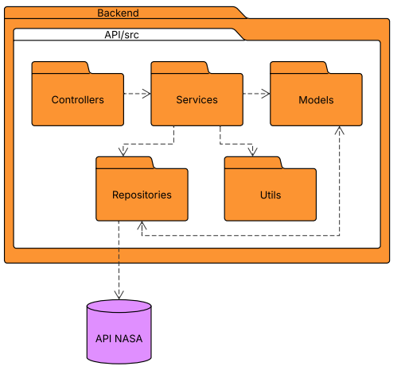
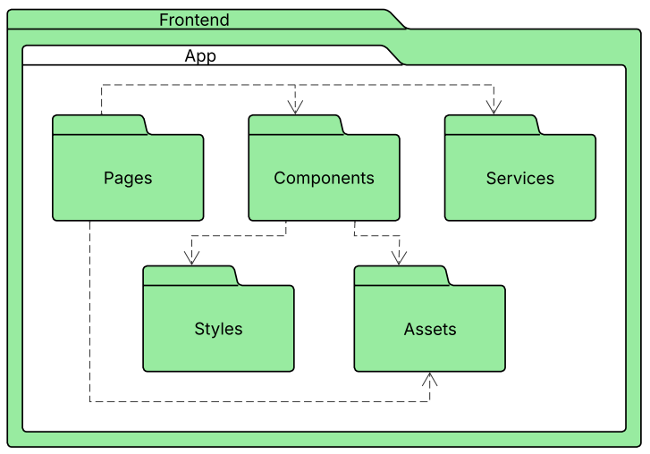

# Diagrama de Pacotes

## Introdução

O Diagrama de Pacotes é uma ferramenta essencial na documentação arquitetural de sistemas, oferecendo uma visão clara e estruturada da organização modular do software. Ele descreve como os diferentes módulos do sistema se agrupam logicamente e como se inter-relacionam, evidenciando as dependências entre os componentes[1](#ref1). Esse diagrama facilita a compreensão da arquitetura do sistema, promovendo uma visão de alto nível da estrutura do software e permitindo uma melhor separação de responsabilidades entre as diversas partes do projeto[2](#ref2). Além disso, o Diagrama de Pacotes se destaca pela sua capacidade de representar não apenas a organização dos módulos, mas também as dependências entre eles, o que é fundamental para o entendimento das interações entre diferentes partes do sistema[3](#ref3).

No contexto do desenvolvimento do **Planetário Virtual**, a equipe de desenvolvimento dedicou-se à elaboração e revisão do Diagrama de Pacotes como um dos componentes chave da documentação arquitetural. O objetivo desse diagrama é mapear de forma clara e objetiva todos os módulos que compõem o sistema, abrangendo tanto o backend quanto o frontend.

Para garantir a qualidade e a consistência dessa modelagem, o trabalho foi realizado de forma colaborativa, com todos os membros do grupo contribuindo ativamente na definição dos pacotes e das interações entre eles. Essa abordagem garantiu uma visão compartilhada e alinhada sobre as responsabilidades de cada componente, além de proporcionar um entendimento comum sobre como as diferentes camadas da aplicação se conectam e interagem.

## Metodologia

A construção dos diagramas de pacotes seguiu uma abordagem colaborativa, com a o grupo identificando os domínios funcionais do sistema e definindo as responsabilidades de cada módulo.

A metodologia focou em três elementos principais:

 1. **Identificação dos Domínios Funcionais:** O sistema foi dividido em pacotes representando os principais domínios de funcionalidade, como Frontend e Backend.

 2. **Agrupamento de Classes e Arquivos:** Dentro de cada domínio, as classes e arquivos foram agrupados em pacotes que refletem a separação de responsabilidades, garantindo um baixo acoplamento e alta coesão.

 3. **Definição de Relacionamentos:** Foram estabelecidos os relacionamentos entre os pacotes, levando em consideração a direção das dependências e a comunicação entre as camadas da aplicação.

Ao longo do processo, utilizamos ferramentas de modelagem UML para validar a estrutura e garantir a coerência com a implementação real do sistema. As decisões foram discutidas em grupo, permitindo um alinhamento técnico e conceitual.

## Diagramas de Pacotes Criados

### Diagrama 1: Arquitetura em Alto Nível

A **figura 1** representa a visão geral do sistema, dividido em três pacotes principais. Foi criado para mostrar uma visão clara da separação entre frontend e backend, algo essencial para a arquitetura do Planetário Virtual. O objetivo era estabelecer uma estrutura modular, onde o frontend fosse responsável apenas pela interação com o usuário e pela exibição de dados, enquanto o backend cuidaria das regras de negócio e da comunicação com fontes externas, como a API da NASA. Essa separação é fundamental para garantir que o sistema seja fácil de manter e escalar no futuro.

Um dos principais desafios foi garantir que a comunicação entre o frontend e o backend fosse clara e bem definida. A equipe teve que estabelecer como as dependências seriam tratadas, principalmente em relação à troca de dados entre essas camadas. Foi necessário definir os pontos de integração de forma precisa, para que cada parte do sistema soubesse como se comunicar corretamente com a outra.

<b>Figura 1:</b> Visão Geral do Sistema

<b>Autores</b>: [Carlos Paz](https://github.com/dudupaz), [João Lucas](https://github.com/jlucasiqueira), [Letícia Martins](https://github.com/leticiatmartins), [Taynara Gabrielle](https://github.com/taybalau) e [Antônio José](https://github.com/antonioleaojr), 2025.

- Visão Geral: Backend se comunica com Frontend

- Frontend: Responsável pela interface com o usuário e pela lógica de apresentação.

- Backend: Contém as regras de negócio e a lógica de processamento do sistema.

### Especificação Estendida – Diagrama 1: Arquitetura em Alto Nível

| Elemento                 | Descrição                                                                                                                                  |
|--------------------------|--------------------------------------------------------------------------------------------------------------------------------------------|
| **Objetivo**             | Apresentar uma visão macro do sistema Planetário Virtual, destacando a separação entre frontend e backend e suas responsabilidades.        |
| **Escopo**               | Toda a aplicação do Planetário Virtual, incluindo suas principais camadas lógicas.                                                         |
| **Pacotes Representados**| `Frontend`, `Backend`, `Comunicação entre pacotes`                                                                                        |
| **Descrição Detalhada**  | O diagrama demonstra a arquitetura em três grandes divisões: o pacote `Frontend`, o pacote `Backend` e a relação entre eles. O Frontend é responsável por toda a interação com o usuário e exibição de dados, enquanto o Backend centraliza as regras de negócio e acesso a dados externos (como a API da NASA). A seta entre os pacotes indica dependência unidirecional do Frontend para o Backend. |
| **Justificativa Arquitetural** | Esta separação de responsabilidades segue o padrão MVC adaptado para aplicações web modernas, facilitando a manutenção, escalabilidade e testabilidade do sistema. |
| **Ferramenta Utilizada** | [Lucidchart](Modelagem/Extra/2.5.2Ferramentas.md)                                                                                                                                 |
| **Autores**              | Carlos Paz, João Lucas, Letícia Martins, Taynara Gabrielle e Antônio José                                                                 |

---

### Diagrama 2: Diagrama de Pacotes do Backend

A **figura 2** detalha a estrutura de Diagrama de Pacotes do Backend, foi dividido em pacotes como Controllers, Services, Repositories, Models e Utils, a fim de garantir a modularidade e a separação das responsabilidades. Os Controllers gerenciam as requisições dos usuários e chamam os Services, que contêm a lógica de negócios. Repositories interagem com o banco de dados ou com a API externa, enquanto Models representam as entidades e Utils fornecem funcionalidades auxiliares.

O maior desafio foi garantir que os Models e os Repositories tivessem uma relação eficiente e que o fluxo de dados entre essas camadas fosse bem controlado. A equipe precisou tomar cuidado para que a lógica de acesso aos dados fosse desacoplada da lógica de negócios e que as dependências entre os pacotes não se tornassem excessivas. Além disso, foi necessário ajustar as interações entre os pacotes para que o sistema fosse robusto e fácil de testar.

<b>Figura 2:</b> Diagrama de Pacotes do Backend

<b>Autores</b>: [Carlos Paz](https://github.com/dudupaz), [João Lucas](https://github.com/jlucasiqueira), [Letícia Martins](https://github.com/leticiatmartins), [Taynara Gabrielle](https://github.com/taybalau) e [Antônio José](https://github.com/antonioleaojr), 2025.

- Controllers usa Services

- Services usa Repositories

- Services usa Utils

- Models e Repositories tem um relacionamento bidirecional

- Models é usado por Services

- Repositories acessa a API da NASA

### Especificação Estendida – Diagrama 2: Pacotes do Backend

| Elemento                 | Descrição                                                                                                                                  |
|--------------------------|--------------------------------------------------------------------------------------------------------------------------------------------|
| **Objetivo**             | Detalhar a arquitetura interna da camada de backend do Planetário Virtual, destacando as dependências entre seus módulos.                 |
| **Escopo**               | Camada de backend do sistema.                                                                                                              |
| **Pacotes Representados**| `Controllers`, `Services`, `Repositories`, `Models`, `Utils`                                                                              |
| **Descrição Detalhada**  | O diagrama evidencia as seguintes relações entre pacotes: • `Controllers` dependem de `Services`. • `Services` utilizam tanto `Repositories` quanto `Utils` para aplicar a lógica de negócio. • `Repositories` acessam diretamente a API da NASA. • `Models` possuem relação bidirecional com `Repositories` e são também utilizados por `Services`. |
| **Justificativa Arquitetural** | O design segue princípios de separação de responsabilidades e desacoplamento entre as camadas. Permite alta coesão dentro dos pacotes e baixo acoplamento entre eles, aderindo aos princípios da Clean Architecture. |
| **Ferramenta Utilizada** | [Lucidchart](Modelagem/Extra/2.5.2Ferramentas.md)                                                                                                                                 |
| **Autores**              | Carlos Paz, João Lucas, Letícia Martins, Taynara Gabrielle e Antônio José                                                                 |

---

### Diagrama 3: Diagrama de Pacotes do Frontend

A **Figura 3** detalha a estrutura de Diagrama de Pacotes do Frontend, a estrutura foi organizada em pacotes como Pages, Components, Services, Assets e Styles. As Pages servem como a entrada principal da aplicação, interagindo com os Components, Services e Assets. Os Components são responsáveis pela construção da interface de usuário e utilizam Styles para a estilização.

O principal desafio no frontend foi garantir que os Components fossem suficientemente reutilizáveis, e que as dependências com Pages e Services fossem bem definidas. A equipe teve que balancear a complexidade da interface com a necessidade de manter os componentes modulares e independentes, facilitando a manutenção e a escalabilidade do código. Outro desafio foi garantir que os Assets (como imagens e ícones) fossem organizados de maneira eficiente, para que o carregamento e a performance do sistema não fossem impactados.

<b>Figura 3:</b> Diagrama de Pacotes do Frontend

<b>Autores</b>: [Carlos Paz](https://github.com/dudupaz), [João Lucas](https://github.com/jlucasiqueira), [Letícia Martins](https://github.com/leticiatmartins), [Taynara Gabrielle](https://github.com/taybalau) e [Antônio José](https://github.com/antonioleaojr), 2025.

- Pages usa Components

- Pages usa Services

- Pages usa Assets

- Components usa Styles

- Components usa Assets

### Especificação Estendida – Diagrama 3: Pacotes do Frontend

| Elemento                 | Descrição                                                                                                                                  |
|--------------------------|--------------------------------------------------------------------------------------------------------------------------------------------|
| **Objetivo**             | Representar a organização modular da camada de frontend, demonstrando as dependências entre seus principais componentes.                  |
| **Escopo**               | Interface do usuário (camada de frontend) da aplicação Planetário Virtual.                                                                |
| **Pacotes Representados**| `Pages`, `Components`, `Services`, `Assets`, `Styles`                                                                                     |
| **Descrição Detalhada**  | As relações entre os pacotes estão organizadas da seguinte forma: • `Pages` importa `Components`, `Services` e `Assets`. • `Components` usa `Styles` para estilização e `Assets` para recursos visuais. • `Services` fornece acesso a dados e lógica de integração para `Pages`. |
| **Justificativa Arquitetural** | A separação dos pacotes melhora a reutilização de componentes e a organização do código. O uso de `Pages` como entrada principal da aplicação reflete práticas comuns em frameworks modernos como React e Next.js. |
| **Ferramenta Utilizada** | [Lucidchart](Modelagem/Extra/2.5.2Ferramentas.md)                                                                                                                                 |
| **Autores**              | Carlos Paz, João Lucas, Letícia Martins, Taynara Gabrielle e Antônio José                                                                 |

## Referências Bibliográficas

>1.  GitMind. **Diagrama de pacotes**. Disponível em: https://gitmind.com/pt/diagrama-de-pacotes. Acesso em: 8 mai. 2025.
>
>2.  Visual Paradigm. **What is Package Diagram?** Disponível em: https://www.visual-paradigm.com/guide/uml-unified-modeling-language/what-is-package-diagram/. Acesso em: 8 mai. 2025.
>
>3.  Oliveira, Diego. **Diagrama de Pacotes**. Disponível em: https://docentes.ifrn.edu.br/diegooliveira/disciplinas/pds/aula-14-diagrama-de-pacotes. Acesso em: 8 mai. 2025.
>
>4.  Lucidchart. **Diagrama de Pacotes UML**. Disponível em: https://www.lucidchart.com/pages/pt/diagrama-de-pacotes-uml. Acesso em: 8 mai. 2025.

## Histórico de Versões

| Versão | Data       | Descrição | Autor           | Revisor                                           |
|--------|------------|----------------------------------------------------------------------------------------------------------|-------------------------------------------------------------|-------------------------------------------------------|
| 1.0    | 08/05/2025 | Inclusão de introdução                                 | [Carlos Paz](https://github.com/dudupaz)                   | [João Lucas](https://github.com/jlucasiqueira)       |
| 1.1    | 08/05/2025 | Adicionada metodologia  | [Carlos Paz](https://github.com/dudupaz)                   | [Letícia Martins](https://github.com/leticiatmartins)|
| 1.2    | 08/05/2025 | Inclusão do Diagrama 1 com descrição estendida sobre a arquitetura geral do sistema                      | [Carlos Paz](https://github.com/dudupaz)                   | [Taynara Gabrielle](https://github.com/taybalau)     |
| 1.3    | 08/05/2025 | Adição do Diagrama 2 com descrição estendida das dependências internas do backend                               | [Carlos Paz](https://github.com/dudupaz)                   | [Antônio José](https://github.com/antonioleaojr)     |
| 1.4    | 08/05/2025 | Inserção do Diagrama 3 com descrição estendida das dependências e organização do frontend                            | [Carlos Paz](https://github.com/dudupaz)                   | [João Lucas](https://github.com/jlucasiqueira)       |
| 1.5    | 08/05/2025 | Adição de referências     | [Carlos Paz](https://github.com/dudupaz)                   | [Taynara Gabrielle](https://github.com/taybalau)     |
| 1.6    | 08/05/2025 | Atualização do histórico de versões                            | [Carlos Paz](https://github.com/dudupaz)                   | [Antônio José](https://github.com/antonioleaojr)     |
